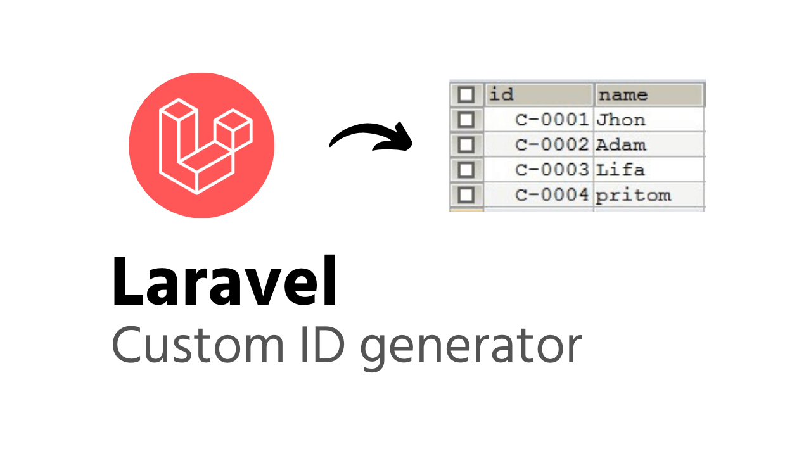

<h1 align="center">Laravel ID Generator</h1>

    
    <a href="https://creativecommons.org/licenses/by/4.0/">

cara mudah membuat Id Unik di Laravel - update from Haruncpi - full maintenance here

## Documentation
Get documentation on [laravelarticle.com](https://laravelarticle.com/laravel-custom-id-generator) Support from Harun CPI

Followed Coding Style [PSR-2](https://github.com/php-fig/fig-standards/blob/master/accepted/PSR-2-coding-style-guide.md)
